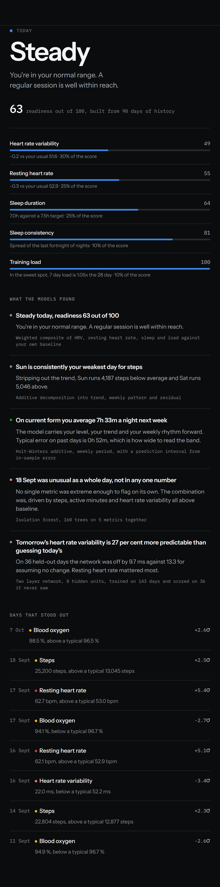
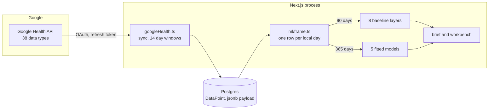
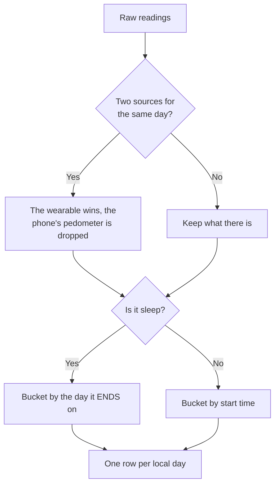
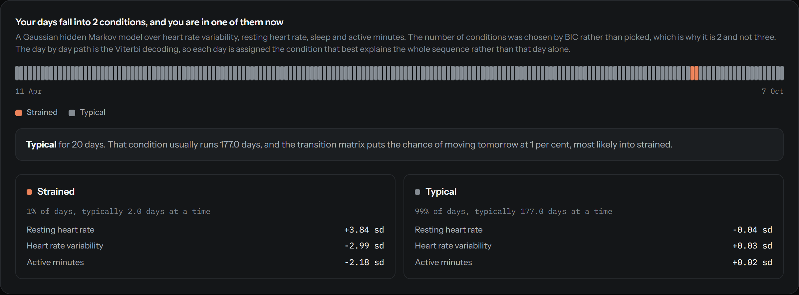
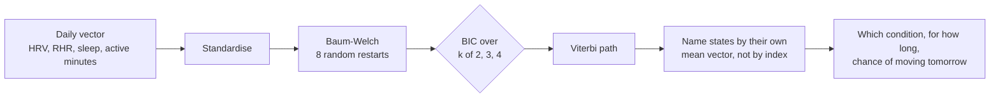
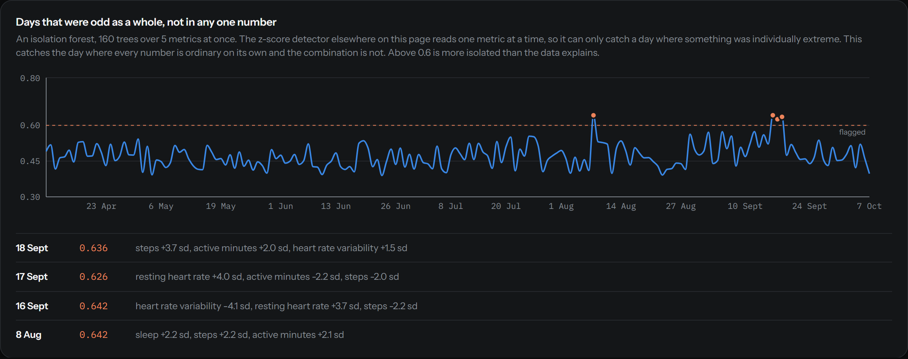
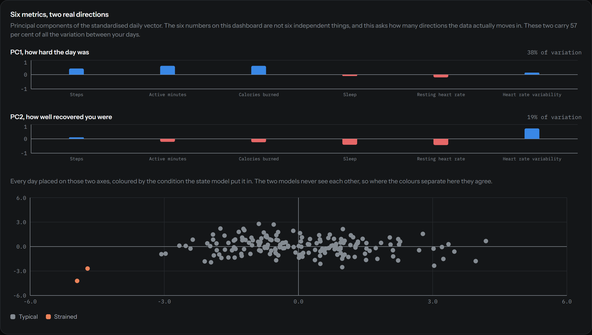
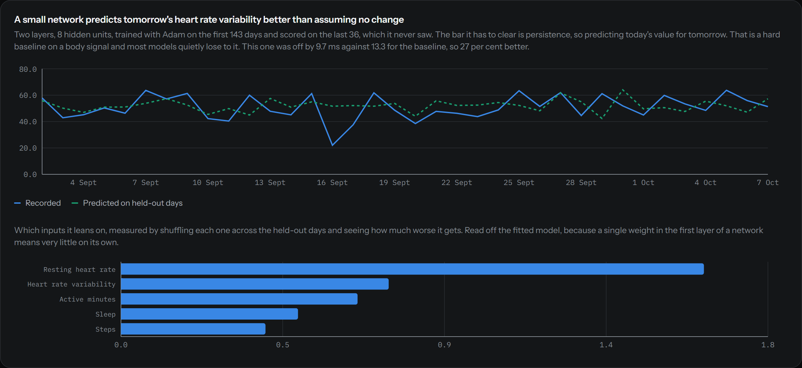

<h1 align="center">Pulse Engine</h1>
<p align="center"><strong>Health signals in, decisions out.</strong></p>
<p align="center">A self-hosted dashboard that pulls every data type the Google Health API exposes for a Fitbit-linked account, keeps it in Postgres forever, and runs thirteen models over it to answer one question each morning. Given what your body has actually been doing, what should you do today?</p>

<p align="center">
  
  
  
  
  
</p>

---

<p align="center">
  
</p>

<p align="center"><sub>The brief is capped at phone width on purpose. One decision, the evidence for it, then everything else below the rule. Screenshots use generated demo data.</sub></p>

---

## No Python, no API calls, no model files

Every model below is written out in TypeScript in this repo, down to the Cholesky decomposition and the backpropagation, and runs server side on request. There is no Python service, no training job, no checkpoint to load and no hosted inference API.

That is a constraint rather than a boast. A health dashboard that phones out to a model you cannot read is a dashboard that cannot tell you why it said something.

## What this is

The app that ships with a wearable shows you last week, throws the rest away, and hands you advice without showing its working. This does the opposite.

| | |
|---|---|
| **Everything, kept** | All 38 data types the Google Health API exposes, raw payload included, in Postgres forever |
| **Compared against you** | Every score is against your own trailing baseline, never a population norm |
| **Thirteen models** | Rolling baselines through to a hidden Markov model and a trained network |
| **It says when it cannot tell** | A model with too little history returns nothing rather than a weaker answer dressed as a real one |
| **It says when it lost** | The network reports its held-out error against a dumb baseline even when the baseline wins |
| **No wearable needed to try it** | `npm run seed:demo` builds 180 days of structured synthetic history |

---

## Run it

You need Node 20 and Docker. You don't need a wearable.

```bash
git clone https://github.com/JamyJames666/FITBIT.git pulse-engine
cd pulse-engine
npm install

cp .env.example .env     # set APP_PASSWORD, and SESSION_SECRET to `openssl rand -hex 32`

docker compose up db -d
npx prisma db push
npm run seed:demo        # 180 days of synthetic history
npm run dev
```

The dashboard is on port 3000. Enter the password you set.

The seeder doesn't produce smooth noise. It builds in a weekly rhythm, a four week training block, two days of illness and a disrupted travel week, because a model layer tested only against clean data looks like it works when it doesn't. Pass a day count to change the span, so `npm run seed:demo -- 365`.

Every seeded row carries source `DEMO` and the seeder removes only those rows, so it can never touch real synced data.

---

## How it fits together



Four stages, each replaceable on its own.

**1. Sync.** `POST /api/sync` walks every data type, fetches anything new since the last successful run in fourteen day windows (the API cap), and batch inserts. Runs are idempotent. The unique key is data type, timestamp and recording device, so re-running a window writes nothing new.

**2. Store.** One wide `DataPoint` table. The raw API payload goes in a `jsonb` column next to a best-effort parsed `value` and `unit`. Parsing is a guess that improves over time. The payload is the record.

**3. Frame.** One SQL pass turns readings into one row per local calendar day. This is where two real problems get solved once instead of thirteen times.



Health Connect records the same walk twice when your phone and watch both see it. And a night's sleep starts the evening before the morning it belongs to, so bucketing sleep by start time puts two nights on one day and none on the next. That bug reported 14.3 hours of sleep before it was found.

**4. Model.** Thirteen layers read that frame. Each returns nothing at all when it lacks the data it needs.

---

## The model stack

The whole stack is a few passes over at most a year of daily rows, so it's cheap enough to recompute on every request rather than cache.

### The eight that score a day against your baseline

| Layer | File | What it is |
|---|---|---|
| Baselines | [`baseline.ts`](src/lib/ml/baseline.ts) | Rolling median and median absolute deviation, plus a 7 day and a 28 day exponentially weighted average. The gap between the fast and slow averages is what "trending up" means everywhere else |
| Anomalies | [`anomaly.ts`](src/lib/ml/anomaly.ts) | A robust z-score against the 28 days *before* each day, never including the day itself. Median absolute deviation rather than standard deviation, so a run of bad days cannot quietly redefine normal and hide the next one |
| Readiness | [`readiness.ts`](src/lib/ml/readiness.ts) | A weighted composite of five parts, each squashed through a logistic so no single freak reading runs away with the total |
| Training load | [`readiness.ts`](src/lib/ml/readiness.ts) | Acute to chronic workload ratio, the last 7 days of effort over the last 28. Well under 1 is detraining, well over is the spike that tends to precede injury |
| Decomposition | [`decompose.ts`](src/lib/ml/decompose.ts) | Classical additive decomposition with a weekly period. A centred 7 day moving average is the trend, what each weekday averages after that is the seasonal term, the rest is residual |
| Clustering | [`cluster.ts`](src/lib/ml/cluster.ts) | k-means with k-means++ seeding on standardised day profiles. k is chosen by mean silhouette width rather than guessed, and the seed is fixed so your day types do not get renamed on every refresh |
| Attribution | [`attribution.ts`](src/lib/ml/attribution.ts) | Ridge regression, rather than ordinary least squares, because these predictors move together and plain regression splits a shared effect between collinear columns almost arbitrarily |
| Forecast | [`forecast.ts`](src/lib/ml/forecast.ts) | Holt-Winters with an additive weekly term. Smoothing constants are fixed rather than fitted, because fitting three parameters on a few weeks of data overfits every time |

### The five that fit a model to the whole window

These read a 365 day frame rather than the 90 day one the rest of the page is showing. The window picker is a reading choice, and 90 days is not enough to fit a hidden Markov model or to hold out a test set worth trusting.

| Layer | File | Method | What it answers |
|---|---|---|---|
| Hidden states | [`states.ts`](src/lib/ml/states.ts) | Gaussian HMM, Baum-Welch with scaled forward-backward, Viterbi decoding, state count by BIC | Which condition is your body in, and how long does that condition usually last |
| Combination anomalies | [`isolation.ts`](src/lib/ml/isolation.ts) | Isolation forest, 160 trees, path-length scoring | Which days were odd *as a whole day*, with no single metric extreme enough to flag |
| Latent factors | [`factors.ts`](src/lib/ml/factors.ts) | PCA via cyclic Jacobi eigendecomposition | How many directions do six metrics actually move in, and what are they |
| Posterior forecast | [`gp.ts`](src/lib/ml/gp.ts) | Gaussian process, RBF + periodic + white noise kernel, Cholesky solve, hyperparameters by exact log marginal likelihood | Is tomorrow worth predicting at all, and how sure can anyone be |
| Next-day network | [`net.ts`](src/lib/ml/net.ts) | Two layer MLP, tanh, Adam, permutation importance | Is tomorrow's HRV more predictable than just guessing today's |

[`index.ts`](src/lib/ml/index.ts) runs them all and turns the output into plain statements, each carrying the method that produced it.

---

## The heavier models, in detail

### Hidden states

Every other layer treats each day as independent. A body is not independent day to day, it sits in a condition for a stretch and then moves. So the useful question is which condition you are in and how long it usually lasts.

<p align="center">
  
</p>



Three details matter more than the algorithm itself.

- **The state count is chosen, not asserted.** BIC's parameter penalty is what stops the model inventing states to fit noise. On the seeded history it picks two, not the three you would guess.
- **States are named by their profile, not their index.** EM returns states in no meaningful order, so without this the same condition is called 1 on one run and 3 on the next, and no sentence built on it survives a refresh. A state whose mean sits on top of the baseline is named `Typical` rather than given a verdict it has not earned.
- **Emissions are computed in log space.** A raw product of four Gaussian densities underflows to zero on an unusual day, and a zero row makes the forward pass divide by zero. Which is exactly the day you care about.

### Combination anomalies

<p align="center">
  
</p>

The z-score layer reads one metric at a time, so it can only catch a day where something was individually extreme. It cannot see the day where every number is ordinary on its own and the combination is not. An isolation forest can, because an unusual point takes fewer random splits to cut off from everything else than a crowded one does.

It only reports a day the univariate detector did not already have. A combination anomaly that is also a plain outlier tells you nothing the line above it did not.

### Latent factors

<p align="center">
  
</p>

Six metrics is six axes to read, and they are not independent. PCA asks how many directions the data actually varies in. The components are named from their own loadings afterwards, so the model is never told that the first one is overall load.

The scatter colours each day by the condition the state model put it in. **The two models never see each other**, so where the colours separate there, they agree independently.

### Posterior forecast

Holt-Winters gives a point forecast with an error bar bolted on, which assumes the error is one size everywhere and asserts a trend whether or not there is one. A Gaussian process returns a posterior instead, and **the hyperparameters it selects are themselves the finding**. A length scale at or beyond the window with a high noise term is the model saying there is no short-term structure here. That is a real answer rather than a failure, and the panel says so in those words.

### Next-day network

<p align="center">
  
</p>

Two layers, eight hidden units, trained with Adam on the first 80 per cent of days and scored on the last 20, which it never sees. Centres and scales come from the training rows only, because computing them over everything leaks the test period's mean into training and quietly flatters the result.

The bar it has to clear is **persistence**, so predicting today's value for tomorrow. That is a genuinely hard baseline on a physiological signal and most published models quietly lose to it. When this one loses, the panel's own headline says it lost. A negative importance bar means the error went *down* when that input was shuffled, so the network is being actively misled by it, and that is drawn in the opposite colour rather than clipped to zero.

---

## Configuration

Everything is an environment variable, and `.env.example` has the full list.

| Variable | Does |
|---|---|
| `DATABASE_URL` | Required. Postgres connection string |
| `NEXT_PUBLIC_BASE_URL` | Every redirect is built from this. Behind a proxy the request URL resolves to the container's internal address, so redirects built from it send people to `0.0.0.0:3000` |
| `NEXT_PUBLIC_TIME_ZONE` | An IANA zone, for example `Europe/London`. Every day boundary uses it, so get it wrong and "today" is wrong |
| `APP_PASSWORD` | The single password gating the site |
| `SESSION_SECRET` | Signs the session cookie. Rotating it logs everyone out |
| `GOOGLE_CLIENT_ID`, `GOOGLE_CLIENT_SECRET` | Optional. Unlocks syncing a real account |

---

## Connect a real account

The legacy Fitbit Web API is deprecated in favour of the Google Health API, so credentials come from Google Cloud.

1. Go to [Google Health API setup](https://developers.google.com/health/setup) and enable the API.
2. Create an OAuth 2.0 Client ID of type **Web server**.
3. Add an authorised redirect URI matching `NEXT_PUBLIC_BASE_URL` exactly, so `http://localhost:3000/api/oauth2callback` locally.
4. On the consent screen's **Audience** page, add yourself as a test user. While the app is in Testing, refresh tokens expire after seven days. Move it to In Production for tokens that last.
5. On the **Data access** page, add the scopes you want. Activity, health metrics, sleep and nutrition are the useful ones. ECG and irregular rhythm are sensitive categories and optional.

Then click **Connect Google account** and run a sync. For scheduled syncing, run `npm run sync` on a cron rather than relying on someone having the page open.

Three of the thirty-eight data types have no list endpoint and are skipped, those being `floors`, `total-calories` and `calories-in-heart-rate-zone`. Google directs you to its rollup API for them, which isn't implemented here.

---

## Changing things

Most changes are one file.

| To change | Where |
|---|---|
| Pull a data type that is not being read | [`dataTypes.ts`](src/lib/dataTypes.ts), then add a parser to `VALUE_EXTRACTORS` in [`googleHealth.ts`](src/lib/googleHealth.ts) |
| Fix a value parsed wrongly | `VALUE_EXTRACTORS` in [`googleHealth.ts`](src/lib/googleHealth.ts). Field names are not consistent across types, so check a real payload in the explorer first |
| What readiness weighs | `WEIGHTS` in [`readiness.ts`](src/lib/ml/readiness.ts). They're renormalised over whichever components have data, so they don't need to sum to 1 after an edit |
| The band thresholds | The `band` assignment in [`readiness.ts`](src/lib/ml/readiness.ts) and the copy in [`bands.ts`](src/lib/ml/bands.ts) |
| How twitchy anomaly detection is | `WATCH`, `NOTABLE` and `EXTREME` in [`anomaly.ts`](src/lib/ml/anomaly.ts). They're in deviations, so 2 means roughly the worst day in twenty |
| How many conditions the state model may use | `STATE_RANGE` in [`states.ts`](src/lib/ml/states.ts). BIC picks from whatever you put in it |
| The GP's kernel or its search grid | `LENGTH_SCALES`, `NOISE_LEVELS` and `PERIODIC_WEIGHTS` in [`gp.ts`](src/lib/ml/gp.ts). Keep the grid wide enough to bracket the optimum, because a selected value sitting at the end of the grid means the best one was outside it |
| The network's shape or training | `HIDDEN`, `EPOCHS` and `LEARNING_RATE` in [`net.ts`](src/lib/ml/net.ts) |
| How far back the heavy models look | `DEEP_WINDOW_DAYS` in [`ml/index.ts`](src/lib/ml/index.ts) |
| How far back everything else looks | `WINDOW_DAYS` in the same file, or pass `?days=` to `/api/insights` |
| Add a metric to the models | `FRAME_METRICS` in [`frame.ts`](src/lib/ml/frame.ts). Say whether it sums over a day or averages, and whether higher is better |
| Colours, spacing or type | The token block at the top of [`globals.css`](src/app/globals.css). Dark leads, light is a selected set of steps rather than a flip |

### Adding a model layer

1. Write a pure function in `src/lib/ml/` taking `DayRow[]` and returning a typed result or `null`.
2. Return `null` whenever the data is too thin. Every existing layer does, and the UI already handles it.
3. Call it in `buildInsights` in [`index.ts`](src/lib/ml/index.ts) and add the result to the `Insights` type.
4. If it should produce a plain statement, add a case to `buildDecisions` and give it a `source` naming the method.
5. Render it in [`ModelPanels.tsx`](src/components/ModelPanels.tsx), or [`DeepPanels.tsx`](src/components/DeepPanels.tsx) if it fits a model rather than scoring a day.

Nothing in `src/lib/ml/` touches the database except `frame.ts`, so you can test a layer by handing it an array.

---

## House rules

- **Show the method with the number.** Every statement on screen carries the model that produced it and the window it ran over. A figure with no provenance does not ship.
- **Compare a body against itself.** Never a population norm. A resting heart rate of 58 is unremarkable in general and a warning sign for someone who normally sits at 48.
- **Absent data is said out loud.** A model with too little history returns `null` and the panel says what it is waiting for. Degrading quietly to a weaker answer is the one thing that is not allowed.
- **A model that loses says it lost.** The network prints its held-out error against the dumb baseline either way.
- **Keep the raw payload.** Parsing is a guess that improves. The `jsonb` column is the record.
- **Validate at the boundary.** Model functions trust their arguments, so the route is where a bad window or index gets rejected.

## What this is not

- **Not medical.** No clinical validation, no cohort, no second user.
- **Not live.** The freshest reading is as fresh as your wearable's last sync to Google, which is minutes to hours, never seconds.
- **Not multi-user.** Connecting a Google account replaces the stored tokens. One password, no accounts.
- **Not complete.** Roughly a tenth of readings arrive in a shape the parser doesn't recognise. Their raw payload is kept, and the explorer shows them marked unparsed.
