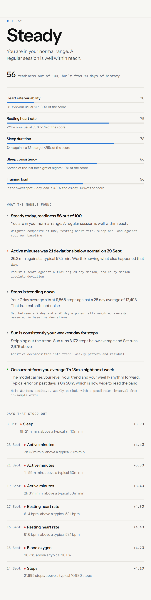
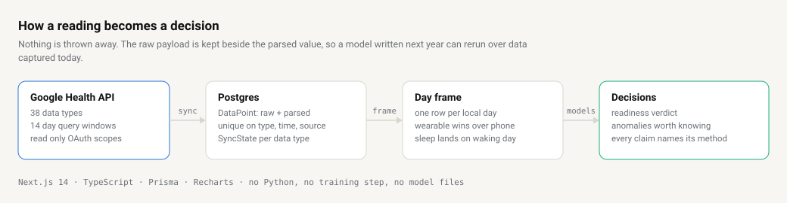
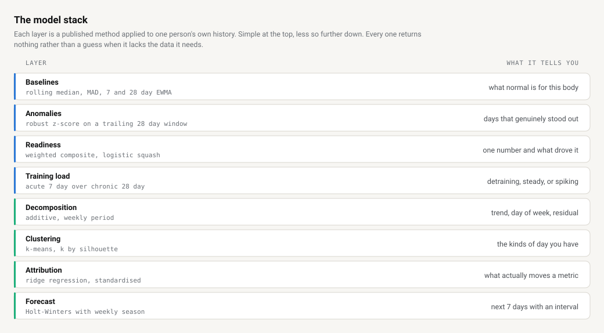
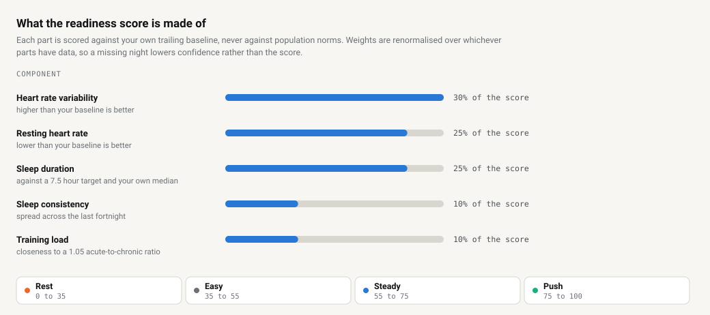

# Pulse Engine

**Health signals in, decisions out.**

A self-hosted dashboard that pulls every data type the Google Health API exposes for a Fitbit-linked account, keeps it in Postgres forever, and runs eight models over it to answer one question each morning. Given what your body has actually been doing, what should you do today?

The app that ships with a wearable shows you last week, throws the rest away, and hands you advice without showing its working. This does the opposite. Every statement on screen names the method behind it and the window it ran over.

<picture>
  <source media="(prefers-color-scheme: dark)" srcset="docs/brief-dark.png">
  
</picture>

> Screenshots use generated demo data. `npm run seed:demo` produces it, so you can run the whole thing without owning a wearable.

---

## Contents

- [How it works](#how-it-works)
- [The model stack](#the-model-stack)
- [Run it in five minutes](#run-it-in-five-minutes)
- [Connect a real account](#connect-a-real-account)
- [Deploy it](#deploy-it)
- [How to change things](#how-to-change-things)
- [Repo map](#repo-map)
- [What this is not](#what-this-is-not)

---

## How it works

<picture>
  <source media="(prefers-color-scheme: dark)" srcset="docs/pipeline-dark.svg">
  
</picture>

Four stages, each one replaceable on its own.

**1. Sync.** `POST /api/sync` walks every data type, fetches anything new since the last successful run in fourteen day windows (the API cap), and batch inserts. Runs are idempotent. The unique key is data type, timestamp and recording device, so re-running a window writes nothing new.

**2. Store.** One wide `DataPoint` table. The raw API payload goes in a `jsonb` column next to a best-effort parsed `value` and `unit`. Parsing is a guess that improves over time. The payload is the record.

**3. Frame.** One SQL pass turns readings into one row per local calendar day. This is where two real problems get solved once instead of eight times. Health Connect records the same walk twice when your phone and watch both see it, so the wearable wins wherever both reported. And a night's sleep starts the evening before the morning it belongs to, so sleep is anchored to the day it ends on.

**4. Model.** Eight layers read that frame and return findings. Each one returns nothing at all when it lacks the data it needs, rather than a weaker answer dressed up as a real one.

---

## The model stack

<picture>
  <source media="(prefers-color-scheme: dark)" srcset="docs/model-stack-dark.svg">
  
</picture>

Everything runs server side in TypeScript on request. There's no Python service, no training step and no model file to load. The whole stack is a few passes over at most two years of daily rows, so it's cheap enough to recompute every time rather than cache.

| Layer | File | What it is |
|---|---|---|
| Baselines | [`baseline.ts`](src/lib/ml/baseline.ts) | Rolling median and median absolute deviation, plus a 7 day and a 28 day exponentially weighted average. The gap between the two fast and slow averages is what "trending up" means everywhere else. |
| Anomalies | [`anomaly.ts`](src/lib/ml/anomaly.ts) | A robust z-score against the 28 days *before* each day, never including the day itself. Uses median absolute deviation rather than standard deviation, so a run of bad days cannot quietly redefine normal and hide the next one. |
| Readiness | [`readiness.ts`](src/lib/ml/readiness.ts) | A weighted composite of five parts, each squashed through a logistic so no single freak reading runs away with the total. |
| Training load | [`readiness.ts`](src/lib/ml/readiness.ts) | Acute to chronic workload ratio, the last 7 days of effort over the last 28. Well under 1 is detraining, well over is the spike that tends to precede injury. |
| Decomposition | [`decompose.ts`](src/lib/ml/decompose.ts) | Classical additive decomposition with a weekly period. A centred 7 day moving average is the trend, what each weekday averages after that is the seasonal term, the rest is residual. |
| Clustering | [`cluster.ts`](src/lib/ml/cluster.ts) | k-means with k-means++ seeding on standardised day profiles. k is chosen by mean silhouette width rather than guessed, and the seed is fixed so your day types do not get renamed on every refresh. |
| Attribution | [`attribution.ts`](src/lib/ml/attribution.ts) | Ridge regression, rather than ordinary least squares, because these predictors move together and plain regression splits a shared effect between collinear columns almost arbitrarily. |
| Forecast | [`forecast.ts`](src/lib/ml/forecast.ts) | Holt-Winters with an additive weekly term. Smoothing constants are fixed rather than fitted, because fitting three parameters on a few weeks of data overfits every time. Intervals come from in-sample error and widen with the square root of the horizon. |

[`index.ts`](src/lib/ml/index.ts) runs them all and turns the output into plain statements, each carrying the method that produced it.

<picture>
  <source media="(prefers-color-scheme: dark)" srcset="docs/readiness-dark.svg">
  
</picture>

Every part is scored against your own trailing baseline, never against a population norm. A resting heart rate of 58 is unremarkable in general and a warning sign for someone who normally sits at 48.

---

## Run it in five minutes

You need Node 20 and Docker. You don't need a wearable.

```bash
git clone https://github.com/JamyJames666/FITBIT.git pulse-engine
cd pulse-engine
npm install

cp .env.example .env
# set APP_PASSWORD to anything, and SESSION_SECRET to `openssl rand -hex 32`

docker compose up db -d
npx prisma db push
npm run seed:demo        # 120 days of synthetic history
npm run dev
```

Open `http://localhost:3000` and enter the password you set.

The seeder doesn't produce smooth noise. It builds in a weekly rhythm, a four week training block, two days of illness and a disrupted travel week, because a model layer tested only against clean data looks like it works when it doesn't. Pass a day count to change the span, for example `npm run seed:demo -- 365`.

Every seeded row carries source `DEMO` and the seeder removes only those rows, so it can never touch real synced data.

---

## Connect a real account

The legacy Fitbit Web API is deprecated in favour of the Google Health API, so credentials come from Google Cloud.

1. Go to [Google Health API setup](https://developers.google.com/health/setup) and enable the API.
2. Create an OAuth 2.0 Client ID of type **Web server**.
3. Add an authorised redirect URI that matches `NEXT_PUBLIC_BASE_URL` exactly, so `http://localhost:3000/api/oauth2callback` locally.
4. Put the client ID and secret in `.env`.
5. On the consent screen's **Audience** page, add yourself as a test user. While the app is in Testing, refresh tokens expire after seven days. Move it to In Production for tokens that last.
6. On the **Data access** page, add the scopes you want. Activity, health metrics, sleep and nutrition are the useful ones. ECG and irregular rhythm are sensitive categories and optional.

Then click **Connect Google account** in the app and run a sync.

Three of the thirty-eight data types have no list endpoint and are skipped, those being `floors`, `total-calories` and `calories-in-heart-rate-zone`. Google directs you to its rollup API for them, which isn't implemented here.

---

## Deploy it

The `Dockerfile` builds a standalone Next.js image and `start.sh` applies the schema before serving, so anything that runs a Dockerfile will do. This one runs on Dokploy behind Traefik.

Set these in your host's environment.

| Variable | Why it matters |
|---|---|
| `DATABASE_URL` | Postgres connection string. |
| `NEXT_PUBLIC_BASE_URL` | Every redirect is built from this. Behind a proxy, the request URL resolves to the container's internal address, so redirects built from it send people to `0.0.0.0:3000`. |
| `NEXT_PUBLIC_TIME_ZONE` | An IANA zone, for example `Europe/London`. Every day boundary uses it, so get it wrong and "today" is wrong. |
| `GOOGLE_CLIENT_ID` / `GOOGLE_CLIENT_SECRET` | From the OAuth client above. |
| `APP_PASSWORD` | The single password gating the site. |
| `SESSION_SECRET` | Signs the session cookie. Rotating it logs everyone out. |

For scheduled syncing, run `npm run sync` on a cron rather than relying on someone having the page open.

---

## How to change things

Most changes are one file.

| You want to | Edit |
|---|---|
| Pull a data type that is not being read | [`dataTypes.ts`](src/lib/dataTypes.ts), then add a parser to `VALUE_EXTRACTORS` in [`googleHealth.ts`](src/lib/googleHealth.ts) |
| Fix a value parsed wrongly | `VALUE_EXTRACTORS` in [`googleHealth.ts`](src/lib/googleHealth.ts). Field names are not consistent across types, so check a real payload in the data explorer first |
| Change what readiness weighs | `WEIGHTS` in [`readiness.ts`](src/lib/ml/readiness.ts). They're renormalised over whichever components have data, so they don't need to sum to 1 after an edit |
| Move the band thresholds | The `band` assignment in [`readiness.ts`](src/lib/ml/readiness.ts) and the copy in [`bands.ts`](src/lib/ml/bands.ts) |
| Make anomaly detection more or less twitchy | `WATCH`, `NOTABLE` and `EXTREME` in [`anomaly.ts`](src/lib/ml/anomaly.ts). They're in deviations, so 2 means roughly the worst day in twenty |
| Add a metric to the models | `FRAME_METRICS` in [`frame.ts`](src/lib/ml/frame.ts). Say whether it sums over a day or averages, and whether higher is better |
| Add a chart to the dashboard | `CHARTS` in [`TrendsSection.tsx`](src/components/TrendsSection.tsx) |
| Add a model panel | [`ModelPanels.tsx`](src/components/ModelPanels.tsx) |
| Change colours, spacing or type | The token block at the top of [`globals.css`](src/app/globals.css). Dark leads, light is a selected set of steps rather than a flip |
| Change how long the models look back | `WINDOW_DAYS` in [`ml/index.ts`](src/lib/ml/index.ts), or pass `?days=` to `/api/insights` |

### Adding a model layer

1. Write a pure function in `src/lib/ml/` that takes `DayRow[]` and returns a typed result or `null`.
2. Return `null` whenever the data is too thin. Every existing layer does, and the UI already handles it.
3. Call it in `buildInsights` in [`index.ts`](src/lib/ml/index.ts) and add the result to the `Insights` type.
4. If it should produce a plain statement, add a case to `buildDecisions` and give it a `source` naming the method.
5. Render it in [`ModelPanels.tsx`](src/components/ModelPanels.tsx).

Nothing in `src/lib/ml/` touches the database except `frame.ts`, so you can test a layer by handing it an array.

---

## Repo map

```
src/
  app/
    api/
      sync/            pull new readings from Google
      insights/        run the model stack, return findings
      summary/         headline figures for a period
      data-points/     generic reader for charts and the explorer
      auth/            password gate, OAuth start and callback
    page.tsx           the dashboard
    globals.css        the whole design system
  components/
    Brief.tsx          verdict, decisions, anomalies
    ModelPanels.tsx    forecast, weekday, drivers, clusters
    TrendChart.tsx     one metric, with drag and scroll zoom
    DataExplorer.tsx   every row, as stored
  lib/
    googleHealth.ts    API client, filters, parsers, sync
    ml/                the model layer
    time.ts            IANA day boundaries
    stats.ts           mean, median, MAD, EWMA, ridge helpers
scripts/
  sync.ts              standalone sync for cron
  seed-demo.ts         synthetic history
```

---

## What this is not

One person's data, modelled honestly, and nothing more.

- **Not medical.** No clinical validation, no cohort, no second user. It compares you against yourself and says so.
- **Not live.** The freshest reading is as fresh as your wearable's last sync to Google, which is minutes to hours, never seconds.
- **Not multi-user.** Connecting a Google account replaces the stored tokens. One password, no accounts.
- **Not complete.** Roughly a tenth of readings arrive in a shape the parser doesn't recognise. Their raw payload is kept, and the explorer shows them marked unparsed.

A model with too little history returns nothing. That's intended, not a bug to work around.
